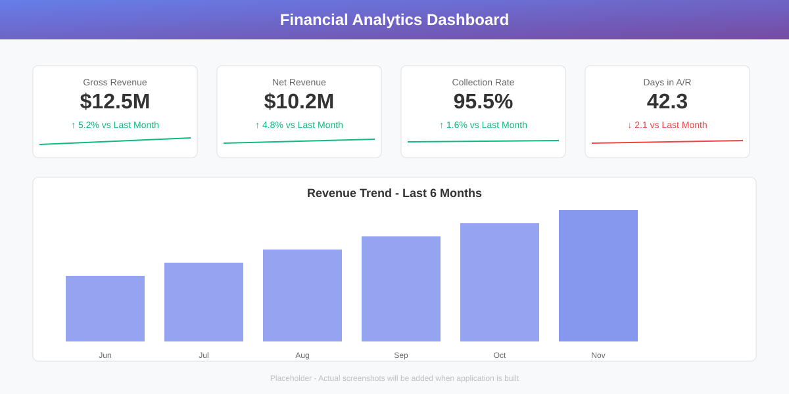
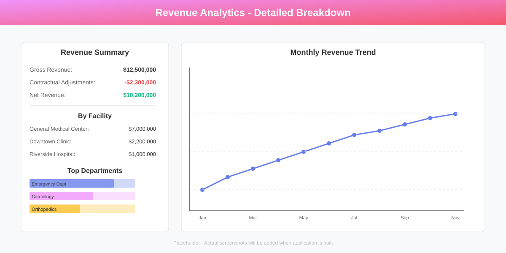
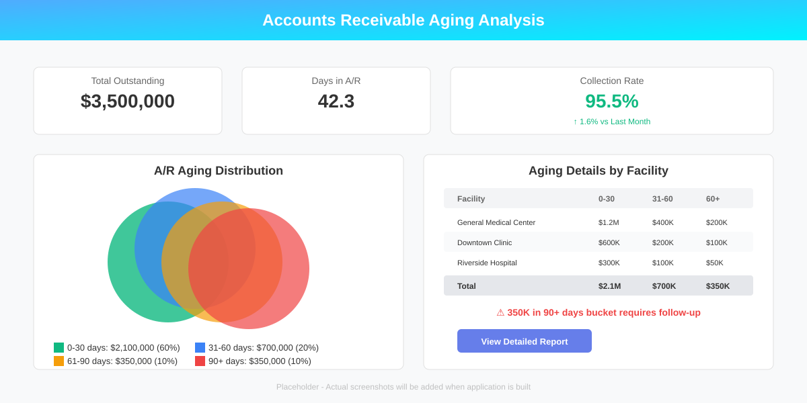
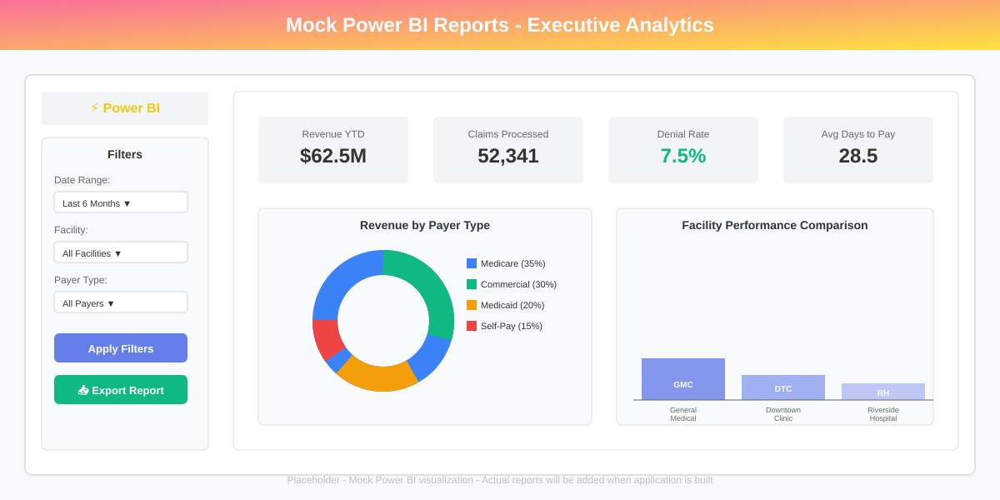
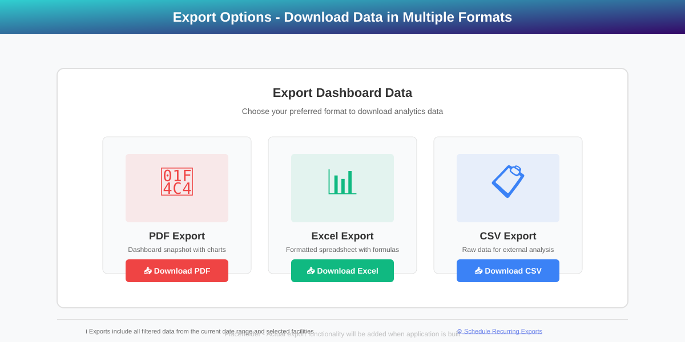

# 🏥 Financial Analytics Dashboard

<div align="center">


**Production-grade healthcare revenue analytics platform with real-time KPIs, interactive visualizations, and executive-level insights**

[Features](#-features) • [Quick Start](#-quick-start) • [Documentation](#-documentation) • [Architecture](#-architecture) • [Demo](#-demo-credentials)

</div>

---

## 📋 Table of Contents

- [Overview](#-overview)
- [Features](#-features)
- [Tech Stack](#-tech-stack)
- [Architecture](#-architecture)
- [Quick Start](#-quick-start)
- [Documentation](#-documentation)
- [Demo Credentials](#-demo-credentials)
- [Screenshots](#-screenshots)
- [Project Structure](#-project-structure)
- [Contributing](#-contributing)
- [License](#-license)

---

## 🎯 Overview

The **Financial Analytics Dashboard** is a comprehensive healthcare revenue cycle management (RCM) platform designed to provide actionable insights into financial operations across multiple facilities. Built with enterprise-grade microservices architecture, it processes thousands of transactions daily and delivers real-time analytics to executives, analysts, and facility managers.

### 🎪 What Makes This Special?

- **🏗️ Microservices Architecture** - Scalable Node.js services with clear separation of concerns
- **📊 15+ Interactive KPIs** - Real-time metrics with drill-down capabilities
- **🎨 Beautiful UI** - Modern Material-UI design with responsive layouts
- **💾 Optimized Database** - PostgreSQL OLAP schema with complex join optimization
- **📈 Mock Power BI Integration** - Embedded analytical reports with interactive visualizations
- **🔐 Enterprise Security** - JWT authentication with role-based access control
- **📤 Multi-Format Exports** - PDF, Excel, and CSV with one click
- **🔔 Smart Alerts** - Threshold-based notifications for critical metrics
- **🐳 Docker Ready** - Complete containerization for easy deployment
- **🚀 CI/CD Pipeline** - GitHub Actions workflow for AWS deployment

---

## ✨ Features

### 💼 Revenue Cycle Management (RCM)

Track the complete revenue lifecycle from patient encounter to final payment:

- **Claims Processing** - Monitor claim submissions, approvals, and denials
- **Payment Tracking** - Real-time payment reconciliation across all payers
- **Adjustment Management** - Track contractual adjustments and write-offs
- **Denial Analysis** - Identify patterns and improve clean claim rates

### 💰 Collections & Accounts Receivable

Optimize cash flow with comprehensive A/R analytics:

- **Aging Analysis** - 30/60/90/120+ day buckets with trending
- **Collection Performance** - Track collection rates and efficiency
- **Outstanding Balances** - Real-time view of uncollected revenue
- **Days in A/R** - Monitor average collection timeframes

### 📊 Interactive Dashboard

Executive-level insights at your fingertips:

- **Real-time KPI Cards** - 15+ metrics with trend indicators (↑↓)
- **Interactive Charts** - Line, bar, pie, and area charts with zoom/pan
- **Drill-down Navigation** - Facility → Department → Payer → Date
- **Date Filtering** - Custom ranges + presets (Today, Week, Month, Quarter, Year, YTD)
- **Comparative Analysis** - Multi-facility performance comparison
- **Responsive Design** - Perfect on desktop, tablet, and mobile

### 📈 Analytics & Reporting

#### 15+ Key Performance Indicators

**Revenue Metrics**
1. **Gross Revenue** - Total charges before adjustments
2. **Net Revenue** - Revenue after adjustments/write-offs
3. **Revenue Growth %** - Month-over-month growth trends
4. **Revenue by Facility** - Multi-facility performance comparison
5. **Revenue per Patient** - Average revenue efficiency metric

**Collections & A/R**
6. **Collection Rate %** - Collections divided by net revenue
7. **Days in A/R** - Average time to collect payment
8. **A/R Aging** - Distribution across 30/60/90/120+ day buckets
9. **Outstanding Balance** - Total uncollected revenue
10. **Cash Collections** - Actual cash received

**Claims Performance**
11. **Clean Claim Rate %** - First-pass claim acceptance rate
12. **Denial Rate %** - Percentage of claims denied
13. **Claim Volume** - Total claims processed in period
14. **Denial Recovery Rate** - Successfully appealed denials

**Operational Metrics**
15. **Patient Volume** - Total patient encounters
16. **Payer Mix %** - Revenue distribution by insurance payer
17. **Revenue Cycle Days** - Average days from submission to payment

### 🎨 Mock Power BI Reports

Embedded analytical reports with realistic visualizations:

- **Executive Summary** - High-level KPIs and trends
- **Revenue Analysis** - Deep dive into revenue patterns
- **A/R Performance** - Collections and aging analysis
- **Payer Analysis** - Performance by insurance provider

### 👥 User Management

Role-based access control for different user types:

- **Admin** - Full system access and user management
- **Executive** - View all reports and dashboards
- **Analyst** - Detailed analytics and exports
- **Facility Manager** - Facility-specific insights

### 📤 Export Capabilities

Download data in multiple formats:

- **PDF** - Dashboard snapshots with charts and branding
- **Excel** - Formatted spreadsheets with multiple sheets
- **CSV** - Raw data for external analysis

### 🔔 Smart Alerting

Proactive notifications for critical thresholds:

- Denial rate exceeds 10%
- Days in A/R above 45 days
- Collection rate drops below 95%
- Outstanding balance spikes detected

---

## 🛠️ Tech Stack

### Backend

| Technology | Purpose | Version |
|------------|---------|---------|
| **NestJS** | Microservices framework | 10.x |
| **Node.js** | Runtime environment | 20.x LTS |
| **TypeScript** | Type-safe development | 5.x |
| **PostgreSQL** | Primary database | 15.x |
| **Prisma** | ORM and migrations | 5.x |
| **JWT** | Authentication | Latest |
| **Express** | HTTP server | 4.x |

### Frontend

| Technology | Purpose | Version |
|------------|---------|---------|
| **React** | UI framework | 18.x |
| **TypeScript** | Type safety | 5.x |
| **Material-UI** | Component library | 5.x |
| **Redux Toolkit** | State management | 2.x |
| **Recharts** | Data visualization | 2.x |
| **React Router** | Navigation | 6.x |
| **Axios** | HTTP client | 1.x |

### DevOps

| Technology | Purpose |
|------------|---------|
| **Docker** | Containerization |
| **Docker Compose** | Multi-container orchestration |
| **GitHub Actions** | CI/CD pipeline |
| **Jest** | Unit & integration testing |
| **Playwright** | E2E testing |
| **ESLint** | Code linting |
| **Prettier** | Code formatting |

---

## 🏗️ Architecture

### Microservices Design

```
┌─────────────────────────────────────────────────────────────┐
│                     CLIENT LAYER                             │
│  ┌─────────────────────────────────────────────────────┐    │
│  │     React Frontend (Material-UI + Redux)            │    │
│  └──────────────────┬──────────────────────────────────┘    │
└────────────────────┼─────────────────────────────────────────┘
                     │ HTTPS
                     │
┌────────────────────▼─────────────────────────────────────────┐
│                  API GATEWAY LAYER                            │
│  ┌──────────────────────────────────────────────────────┐    │
│  │  • Rate Limiting  • Authentication  • Routing        │    │
│  │  • Request Validation  • CORS  • Logging             │    │
│  └──────────────────┬───────────────────────────────────┘    │
└────────────────────┼─────────────────────────────────────────┘
                     │
        ┌────────────┼────────────┬────────────┬───────────┐
        │            │            │            │           │
┌───────▼──────┐ ┌──▼──────────┐ ┌▼──────────┐ ┌▼─────────────┐
│   Auth       │ │  Analytics  │ │   Data    │ │  Reporting   │
│  Service     │ │   Service   │ │  Service  │ │   Service    │
│              │ │             │ │           │ │              │
│ • JWT Auth   │ │ • KPI Calc  │ │ • CRUD    │ │ • PDF Export │
│ • User Mgmt  │ │ • Metrics   │ │ • Query   │ │ • Excel Gen  │
│ • RBAC       │ │ • Trends    │ │ • Filter  │ │ • CSV Export │
└───────┬──────┘ └──┬──────────┘ └┬──────────┘ └┬─────────────┘
        │           │              │             │
        └───────────┴──────────────┴─────────────┘
                           │
                  ┌────────▼─────────┐
                  │   PostgreSQL     │
                  │   (OLAP Schema)  │
                  │                  │
                  │ • Fact Tables    │
                  │ • Dimensions     │
                  │ • Indexes        │
                  │ • Materialized   │
                  │   Views          │
                  └──────────────────┘
```

### Data Flow

```
┌─────────────┐
│   Patient   │
│  Encounter  │
└──────┬──────┘
       │
       ▼
┌─────────────────┐
│  Claim Created  │
│  (Data Service) │
└──────┬──────────┘
       │
       ▼
┌──────────────────────┐
│  Stored in Database  │
│  (PostgreSQL OLAP)   │
└──────┬───────────────┘
       │
       ▼
┌─────────────────────────────┐
│  Analytics Service          │
│  • Calculates KPIs          │
│  • Updates Aggregations     │
│  • Detects Threshold Alerts │
└──────┬──────────────────────┘
       │
       ▼
┌──────────────────────┐
│  Frontend Dashboard  │
│  • Fetches Metrics   │
│  • Renders Charts    │
│  • Shows Alerts      │
└──────────────────────┘
```

---

## 🚀 Quick Start

### Prerequisites

Ensure you have the following installed:

- **Node.js** (v20.x or higher) - [Download](https://nodejs.org/)
- **Docker** & **Docker Compose** - [Download](https://www.docker.com/)
- **Git** - [Download](https://git-scm.com/)
- **PostgreSQL** (15.x) - Optional if using Docker

### Installation

```bash
# 1. Clone the repository
git clone https://github.com/yourusername/financial-analytics-dashboard.git
cd financial-analytics-dashboard

# 2. Install dependencies for all services
npm run install:all

# 3. Set up environment variables
cp .env.example .env
# Edit .env with your configuration

# 4. Start PostgreSQL with Docker
docker-compose up -d postgres

# 5. Run database migrations
npm run migrate

# 6. Seed the database with sample data
npm run seed

# 7. Start all microservices and frontend
npm run dev
```

### Using Docker (Recommended)

```bash
# Start all services with one command
docker-compose up -d

# View logs
docker-compose logs -f

# Stop all services
docker-compose down
```

### Access the Application

Once running, access the application at:

- **Frontend**: http://localhost:3000
- **API Gateway**: http://localhost:4000
- **Auth Service**: http://localhost:4001
- **Analytics Service**: http://localhost:4002
- **Data Service**: http://localhost:4003
- **Reporting Service**: http://localhost:4004

---

## 📚 Documentation

Comprehensive guides for every aspect of the platform:

| Document | Description |
|----------|-------------|
| **[SETUP.md](docs/SETUP.md)** | Complete installation and configuration guide |
| **[USER_GUIDE.md](docs/USER_GUIDE.md)** | How to use every feature of the application |
| **[ARCHITECTURE.md](docs/ARCHITECTURE.md)** | System design, data models, and technical decisions |
| **[API_DOCUMENTATION.md](docs/API_DOCUMENTATION.md)** | Complete REST API reference with examples |
| **[DEPLOYMENT.md](docs/DEPLOYMENT.md)** | AWS deployment and production configuration |
| **[CONTRIBUTING.md](CONTRIBUTING.md)** | Guidelines for contributing to the project |

---

## 🔑 Demo Credentials

Pre-configured user accounts for testing:

### Admin User
```
Email: admin@healthcare.com
Password: Admin@2024
Role: Administrator
Access: Full system access
```

### Executive User
```
Email: executive@healthcare.com
Password: Exec@2024
Role: Executive
Access: All dashboards and reports
```

### Analyst User
```
Email: analyst@healthcare.com
Password: Analyst@2024
Role: Data Analyst
Access: Analytics and exports
```

### Facility Manager
```
Email: manager@healthcare.com
Password: Manager@2024
Role: Facility Manager
Access: Single facility view
```

---

## 🖼️ Screenshots

### Dashboard Overview

*Real-time KPI cards with trend indicators and interactive charts*

### Revenue Analytics

*Detailed revenue breakdown with drill-down capabilities*

### A/R Aging Analysis

*Comprehensive accounts receivable aging buckets*

### Mock Power BI Reports

*Embedded analytical reports with interactive filtering*

### Export Options

*Download data as PDF, Excel, or CSV*

---

## 📁 Project Structure

```
financial-analytics-dashboard/
│
├── 📂 backend/                      # Backend microservices
│   ├── 📂 api-gateway/              # Main entry point & routing
│   │   ├── 📂 src/
│   │   │   ├── main.ts              # Bootstrap
│   │   │   ├── app.module.ts        # Root module
│   │   │   ├── middleware/          # Rate limiting, CORS
│   │   │   └── routes/              # Route definitions
│   │   ├── 📂 tests/                # Integration tests
│   │   └── package.json
│   │
│   ├── 📂 auth-service/             # Authentication & authorization
│   │   ├── 📂 src/
│   │   │   ├── auth/                # JWT, login, register
│   │   │   ├── users/               # User management
│   │   │   └── rbac/                # Role-based access
│   │   └── package.json
│   │
│   ├── 📂 analytics-service/        # KPI calculations & metrics
│   │   ├── 📂 src/
│   │   │   ├── kpis/                # 15+ KPI calculators
│   │   │   ├── trends/              # Trend analysis
│   │   │   └── alerts/              # Threshold monitoring
│   │   └── package.json
│   │
│   ├── 📂 data-service/             # CRUD operations
│   │   ├── 📂 src/
│   │   │   ├── claims/              # Claims endpoints
│   │   │   ├── payments/            # Payments endpoints
│   │   │   ├── facilities/          # Facilities endpoints
│   │   │   └── filters/             # Query filters
│   │   └── package.json
│   │
│   ├── 📂 reporting-service/        # Export & reports
│   │   ├── 📂 src/
│   │   │   ├── pdf/                 # PDF generation
│   │   │   ├── excel/               # Excel generation
│   │   │   └── csv/                 # CSV generation
│   │   └── package.json
│   │
│   └── 📂 shared/                   # Common utilities
│       ├── 📂 src/
│       │   ├── database/            # Prisma client
│       │   ├── utils/               # Helper functions
│       │   └── types/               # TypeScript types
│       └── package.json
│
├── 📂 frontend/                     # React frontend application
│   ├── 📂 public/                   # Static assets
│   ├── 📂 src/
│   │   ├── 📂 components/           # Reusable UI components
│   │   │   ├── KPICard.tsx          # Metric display card
│   │   │   ├── Chart.tsx            # Chart wrapper
│   │   │   ├── DateFilter.tsx       # Date range selector
│   │   │   └── ExportButton.tsx     # Export functionality
│   │   │
│   │   ├── 📂 pages/                # Page components
│   │   │   ├── Dashboard.tsx        # Main dashboard
│   │   │   ├── Reports.tsx          # Power BI reports
│   │   │   ├── Analytics.tsx        # Detailed analytics
│   │   │   ├── Admin.tsx            # User management
│   │   │   └── Login.tsx            # Authentication
│   │   │
│   │   ├── 📂 store/                # Redux state management
│   │   │   ├── authSlice.ts         # Auth state
│   │   │   ├── metricsSlice.ts      # Metrics state
│   │   │   └── filterSlice.ts       # Filter state
│   │   │
│   │   ├── 📂 services/             # API client services
│   │   │   ├── authService.ts       # Auth API calls
│   │   │   ├── analyticsService.ts  # Analytics API
│   │   │   └── dataService.ts       # Data API
│   │   │
│   │   ├── 📂 hooks/                # Custom React hooks
│   │   │   ├── useAuth.ts           # Authentication hook
│   │   │   ├── useMetrics.ts        # Metrics fetching
│   │   │   └── useFilters.ts        # Filter management
│   │   │
│   │   ├── 📂 utils/                # Helper utilities
│   │   │   ├── formatters.ts        # Number/date formatting
│   │   │   └── validators.ts        # Form validation
│   │   │
│   │   ├── App.tsx                  # Root component
│   │   └── index.tsx                # Entry point
│   │
│   └── package.json
│
├── 📂 database/                     # Database configuration
│   ├── schema.prisma                # Prisma schema definition
│   ├── 📂 migrations/               # Database migrations
│   └── 📂 seeds/                    # Sample data generation
│       ├── facilities.seed.ts       # 3 facility records
│       ├── claims.seed.ts           # ~50K transaction records
│       └── users.seed.ts            # Demo user accounts
│
├── 📂 docker/                       # Docker configuration
│   ├── Dockerfile.api-gateway       # Gateway container
│   ├── Dockerfile.auth              # Auth service container
│   ├── Dockerfile.analytics         # Analytics container
│   ├── Dockerfile.data              # Data service container
│   ├── Dockerfile.reporting         # Reporting container
│   ├── Dockerfile.frontend          # Frontend container
│   └── docker-compose.yml           # Multi-container setup
│
├── 📂 .github/                      # GitHub configuration
│   └── 📂 workflows/
│       ├── ci.yml                   # Continuous integration
│       └── cd.yml                   # Continuous deployment
│
├── 📂 docs/                         # Documentation
│   ├── SETUP.md                     # Setup instructions
│   ├── USER_GUIDE.md                # User manual
│   ├── ARCHITECTURE.md              # Architecture docs
│   ├── API_DOCUMENTATION.md         # API reference
│   ├── DEPLOYMENT.md                # Deployment guide
│   └── 📂 images/                   # Screenshots
│
├── .env.example                     # Environment template
├── .gitignore                       # Git ignore rules
├── package.json                     # Root package file
├── tsconfig.json                    # TypeScript config
├── README.md                        # This file
└── LICENSE                          # MIT License
```

---

## 🧪 Testing

### Run All Tests

```bash
# Unit tests
npm run test

# Integration tests
npm run test:integration

# E2E tests
npm run test:e2e

# Coverage report
npm run test:coverage
```

### Test Coverage Goals

- Unit Tests: **80%+** coverage
- Integration Tests: All API endpoints
- E2E Tests: Critical user workflows

---

## 🤝 Contributing

We welcome contributions! Please see our [Contributing Guide](CONTRIBUTING.md) for details.

### Development Workflow

1. Fork the repository
2. Create a feature branch (`git checkout -b feature/amazing-feature`)
3. Commit your changes (`git commit -m 'Add amazing feature'`)
4. Push to the branch (`git push origin feature/amazing-feature`)
5. Open a Pull Request

### Code Standards

- **TypeScript** for all new code
- **ESLint** and **Prettier** for formatting
- **Jest** for testing
- Follow existing patterns and conventions

---

## 📄 License

This project is licensed under the **MIT License** - see the [LICENSE](LICENSE) file for details.

---

## 🙏 Acknowledgments

- **Material-UI** for the beautiful component library
- **NestJS** for the robust microservices framework
- **Prisma** for the excellent ORM
- **Recharts** for interactive visualizations
- Open source community for amazing tools

---

## 📞 Support

Need help? Here's how to get support:

- 📧 **Email**: support@healthcare-analytics.com
- 💬 **Discord**: [Join our community](https://discord.gg/healthcare-analytics)
- 🐛 **Issues**: [GitHub Issues](https://github.com/yourusername/financial-analytics-dashboard/issues)
- 📖 **Documentation**: [Full Docs](docs/)

---

## 🗺️ Roadmap

### Version 1.1 (Coming Soon)
- [ ] Real Power BI integration
- [ ] Advanced forecasting with ML
- [ ] Mobile app (React Native)
- [ ] Real-time websocket updates

### Version 2.0 (Future)
- [ ] Multi-tenant support
- [ ] Advanced AI insights
- [ ] Integration with EHR systems
- [ ] Custom report builder

---

<div align="center">

**⭐ If you find this project useful, please give it a star! ⭐**

Made with ❤️ by the Healthcare Analytics Team

[⬆ Back to Top](#-financial-analytics-dashboard)

</div>
